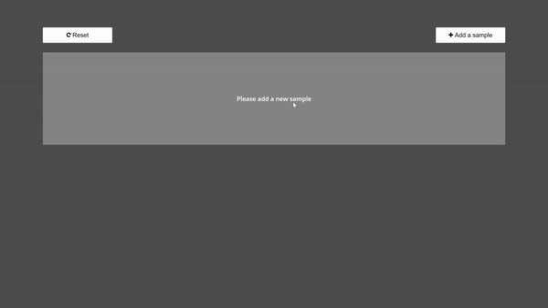
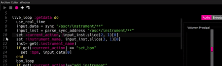
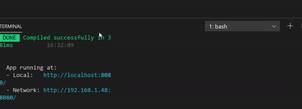

# BeatPad Pi

This application (written in Vue.js and Node.js) allows you to create and manage beats in Sonic Pi through a graphical interface.




## Prerequisites

Before you start, you need to have **Node.js** and **Sonic Pi** installed on your computer.
To download node you can use this link: 
   https://nodejs.org/en/download/

To download Sonic Pi use the following link:
   https://sonic-pi.net/

## Installation

1. Download or clone this repository on your computer

2. Navigate into the project you just downloaded, copy the beatPadPi.rb file and paste it into Sonic Pi.

3. Once pasted in Sonic PI, press play
   
   

4. Open a terminal and navigate to the folder you downloaded:

   ```shell
   cd your_folder
   ```

5. Type :

   ```shell
   node server
   ```

6. Open another terminal (still in the same path) and type:

   ```shell
   npm install
   ```

7. When the installation is complete, write:

   ```shell
   npm run serve
   ```

8. Click the link that appears in your terminal to open the app:

   

## Configuring your ports

If you want to configure app ports, you can rename .env.example to .env and modify the constant values
  
## Built With

* Node.js - Used to to send data to Sonic Pi
* Vue.js - User interface and interaction with the app
* Sonic Pi - Magic happens here :)

## Versioning

We use [SemVer](http://semver.org/) for versioning. For the versions available, see the [tags on this repository](https://github.com/your/project/tags). 

## Authors and contributors

Author: **RicardoTormo** - *Idea and main developer*
Contributor: **AdrianiFs** https://github.com/AdrianiFS - *CSS and UI help* 

## License

This project is licensed under the MIT License - see the [LICENSE.md](LICENSE.md) file for details

## Acknowledgments

I would like to say thanks to the awesome members of Sonic Pi's community. They've helped me a lot.